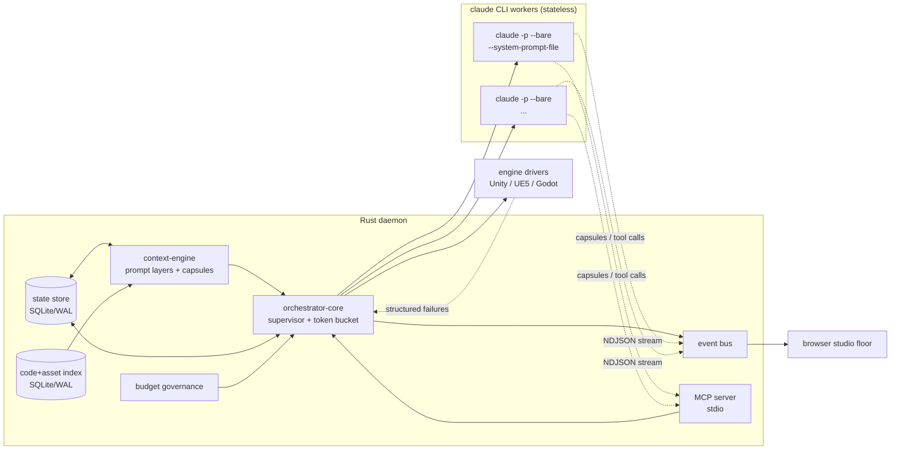

# 00: System Overview

> **Status:** v0.1, 2026-07-20, design phase, no runtime code.
> Part of the Game Studio Crew system design set. See [README](../../README.md).

## Prime directive

> **Feed the model minimum viable context, and never pay twice for the same tokens.**

Every design decision in this set is downstream of that sentence. Context is assembled by the daemon, not accumulated in a conversation. Bytes that repeat across invocations are frozen so prompt caching pays for them once. Bytes that don't earn their place are not sent.

## What this is

Game Studio Crew is a re-architecture of `claude-code-game-studios`. The original packs 49 markdown agents, 73 slash commands, 12 hooks and 11 rule files into a **single** Claude Code conversation. Consequences:

- Every invocation reloads `CLAUDE.md` and ambient project context.
- Subagents inherit bloated prompts they can't trim.
- There is no state store, no summarization, no context handoff between steps.
- Token burn is enormous, and the studio is invisible while it works. You get a wall of text, not a view of what the team is doing.

The rebuild is a **Rust daemon** that treats `claude` CLI subprocesses as **stateless workers**. The daemon owns all context, all budget, all state, and streams a realtime event feed to a browser-based visual studio floor. Workers are cheap, disposable, and told only what they need for one task.

- **Tier 1** is the top of the tree: a single `studio_director` seat on **Fable 5**.
- **Tier 2 and Tier 3** (department leads and specialists) run on **Opus 4.8**.

Fable is the more expensive model, not the cheaper one ($10/$50 per MTok against Opus at $5/$25), which is exactly why it sits on the one lowest-volume seat. See [04](04-agent-graph.md).
- **Unity, Unreal Engine 5 and Godot 4** are all first-class.

**Hard constraint: no API keys.** Everything runs through the user's Claude Code **subscription** via the CLI. This is the founding decision. See [ADR 0001](adr/0001-claude-cli-as-worker.md).

## System shape

Workers never talk to each other and never hold durable state. They read a frozen system prompt, receive one volatile task brief, do work, emit a **capsule** through the MCP tool, and exit. The daemon reduces their NDJSON output and MCP calls into events, ledger rows, and state transitions.

## Crate map

Rough Cargo workspace layout the docs assume (names, not a commitment):

| Crate | Owns | Design doc |
|---|---|---|
| `studio-core` | worker supervisor, token bucket, watchdog, process reaping, crash recovery | [01](01-orchestrator-core.md) |
| `studio-context` | layered prompts, charter freezing/hashing, capsules, summarization ladder, symbol index feed | [02](02-context-engine.md) |
| `studio-store` | state SQLite (WAL, single-writer actor), ledger, budgets | [03](03-state-store.md) |
| `studio-agents` | role registry, meeting/delegation/escalation logic | [04](04-agent-graph.md) |
| `studio-events` | event envelope, enum, NDJSON→studio mapping, resume/coalescing | [05](05-event-protocol.md) |
| `studio-budget` | task/sprint budgets, enforcement points, degradation ladder | [06](06-budget-governance.md) |
| `studio-engine` | engine profiles, charter fragments, `EngineDriver` trait | [07](07-engine-layer.md) |
| `studio-verify` | `verify()` contract, per-engine report parsers, repair loop | [08](08-verification.md) |
| `studio-workflow` | TOML DAG workflows, node/edge/gate execution | [09](09-workflows.md) |
| `studio-standards` | rule modes (lint/check/prompt), R0-R4 trust model | [10](10-standards-and-trust.md) |
| `studio-index` | engine detection, index SQLite, tree-sitter extractors, watcher | [11](11-index-and-bootstrap.md) |
| `studio-ui` | browser studio floor (separate frontend build) | [12](12-visual-workspace.md) |

Two **separate** SQLite databases: the **state store** ([03](03-state-store.md)) holds runtime state; the **index** ([11](11-index-and-bootstrap.md)) holds the code/asset map. They are never the same file and never share a connection pool.

## Verified CLI facts the design rests on

Confirmed against `code.claude.com` docs this session. Every doc that leans on the CLI cites this list rather than re-deriving it.

- `claude -p --output-format stream-json --include-partial-messages` streams NDJSON: `system`/`init`, `stream_event` with `content_block_delta`, tool use, tool result, and a terminal `result`.
- **`--bare`** skips auto-loading of `CLAUDE.md`, hooks, skills, plugins and MCP. This is the **primary token lever**.
- `--system-prompt-file` replaces the system prompt entirely. `--model` accepts `fable`, `opus` and `haiku`. `--effort low|medium|high|xhigh|max`.
- `--session-id`, `--resume`, `--fork-session`. Sessions persist as JSONL under `~/.claude/projects/<slug>/`; lookup is scoped to the working directory.
- The terminal `result` carries `usage` (`input`, `output`, `cache_read`, `cache_creation`) plus `cost_usd` and `modelUsage`.
- Prompt caching is automatic, keyed on **exact system-prompt bytes + model**, TTL **5 minutes**. Identical prefixes across separate subprocesses **do** hit cache.
- `--permission-mode dontAsk` with `--allowedTools` runs fully non-interactive.
- A Rust process can serve **MCP over stdio**, so workers can call back into the orchestrator.

### Two unverified behaviors (M1 settles these first)

Both have designed fallbacks so the architecture does not depend on the answer:

1. **Does `--mcp-config` still attach under `--bare`?** If not, the fallback is a **watched outbox directory**: workers write capsules to a file the daemon watches via `notify`. See [02](02-context-engine.md) and [13](13-risks.md).
2. **Do streamed events carry usable interim `usage` deltas?** If not, the fallback is **EMA-based estimation** for in-flight budgeting that **settles to exact numbers at the `result` event**. See [06](06-budget-governance.md) and [13](13-risks.md).

## Milestone order

- **M0 (this phase):** design documents only. Reviewed and iterated before any code.
- **M1:** supervisor + state store + ledger. Spawn one `--bare` worker; prove (a) usage capture from `result`, (b) cache hit on a second same-role spawn within the TTL, (c) clean process reaping on Windows. **M1 exists specifically to settle the two unverified CLI behaviors** before anything else is built on them.
- **M2:** context engine: frozen charters, capsules, summarization ladder.
- **M3:** one engine end-to-end (Godot first: fully headless, no editor lock) through verify + repair loop.
- **M4:** event protocol + minimal studio floor (avatars, status rings, event feed).
- **M5:** workflows, budget governance, remaining engines, full visual workspace.

## Reading order

Start here, then [02 context-engine](02-context-engine.md) for the token story, then [04 agent-graph](04-agent-graph.md) for the roles. [13 risks](13-risks.md) is the honest list of what could break.

## Document set

| # | Doc | Owns (single source of truth for) |
|---|---|---|
| 00 | overview | crate map, CLI facts, milestones, prime directive |
| 01 | [orchestrator-core](01-orchestrator-core.md) | worker lifecycle, supervision |
| 02 | [context-engine](02-context-engine.md) | prompt layers, capsule schema, summarization, token math |
| 03 | [state-store](03-state-store.md) | **state** SQLite schema, ledger |
| 04 | [agent-graph](04-agent-graph.md) | **the 13-role registry** |
| 05 | [event-protocol](05-event-protocol.md) | **event envelope + enum** |
| 06 | [budget-governance](06-budget-governance.md) | budget model, degradation ladder |
| 07 | [engine-layer](07-engine-layer.md) | **engine profile schema + 3 profiles** |
| 08 | [verification](08-verification.md) | `verify()` contract, report parsers |
| 09 | [workflows](09-workflows.md) | workflow DAG schema |
| 10 | [standards-and-trust](10-standards-and-trust.md) | rule modes, R0-R4 trust |
| 11 | [index-and-bootstrap](11-index-and-bootstrap.md) | **index** SQLite schema, detection |
| 12 | [visual-workspace](12-visual-workspace.md) | studio floor, event→visual mapping |
| 13 | [risks](13-risks.md) | consolidated risk register |
| ADR | [0001](adr/0001-claude-cli-as-worker.md) · [0002](adr/0002-thirteen-roles.md) · [0003](adr/0003-top-down-not-isometric.md) | decision records |
