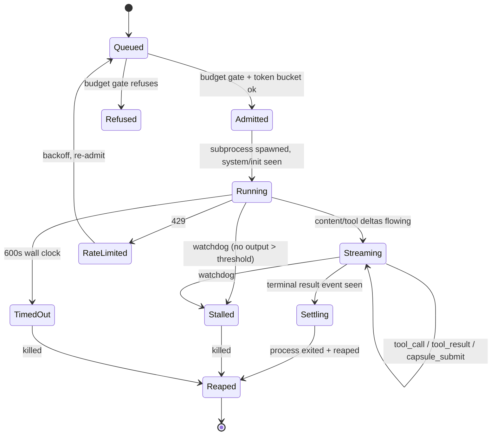

# 01: Orchestrator Core

> **Status:** v0.1, 2026-07-20, design phase, no runtime code.
> **Owns:** the worker lifecycle state machine, the outcome enum, and process supervision. Consumes the context engine ([02](02-context-engine.md)) for prefixes, the state store ([03](03-state-store.md)) for persistence and recovery, the budget gate ([06](06-budget-governance.md)) pre-spawn, and emits the worker events in [05](05-event-protocol.md).

## Role

`studio-core` is the process supervisor. It turns "run this task with this role" into a `claude` subprocess, watches it, translates its NDJSON into events and ledger rows, reaps it cleanly on every platform, and recovers in-flight work after a crash. Everything above it (workflows, budgets, context) hands it tasks; it owns the OS-level reality of subprocesses.

## Spawn

One task → one `claude` invocation, assembled from the layered prompt ([02](02-context-engine.md)):

```
claude -p
  --bare
  --system-prompt-file <frozen L0..L2 charter>   # 02; prefix_hash recorded in sessions (03)
  --model <fable|opus>                            # from role tier (04)
  --effort <low|medium|high|xhigh|max>            # role floor, possibly degraded (06)
  --session-id <new uuid>                         # or --resume for repair/recovery
  --permission-mode dontAsk --allowedTools <role allowlist>  # 04
  --output-format stream-json --include-partial-messages
  --mcp-config <orchestrator stdio MCP>           # if it attaches under --bare (unverified, 00)
  < <L3 task brief on stdin>
```

Pre-spawn, the supervisor consults the **budget gate** ([06](06-budget-governance.md)): projected input (known prefix size + L3 size) plus an output reserve must fit under the task and sprint budgets, or the spawn is degraded/refused before any tokens are paid. On spawn it writes the `sessions` row ([03](03-state-store.md)) and emits `worker_spawned` ([05](05-event-protocol.md)).

## Worker lifecycle state machine



Each transition emits `worker_state_changed` ([05](05-event-protocol.md)). The `tasks.state` column ([03](03-state-store.md)) mirrors the current state for crash recovery.

## Outcome enum

Set once, at `Reaped`, and written to `tasks.outcome` ([03](03-state-store.md)):

```rust
enum Outcome {
    Completed,        // clean result, capsule submitted
    CompletedNoCapsule, // clean exit but no capsule. A protocol violation, flagged
    Refused,          // budget gate refused pre-spawn
    Stalled,          // watchdog killed it
    TimedOut,         // 600s wall clock
    RateLimitedOut,   // exhausted 429 retries
    Crashed,          // non-zero exit without a result event
    Killed,           // operator/degradation hard stop (06)
}
```

`Completed` is the only clean terminal outcome; the rest are the taxonomy the budget ladder, the infra queue, and the floor's status rings key off of.

## AIMD token bucket over estimated TPM

The subscription meters tokens per minute and answers 429 when exceeded ([13](13-risks.md): the limit is opaque). Admission uses an **AIMD** (additive-increase / multiplicative-decrease) token bucket over *estimated* TPM:

- Each admission debits the bucket by the worker's projected token cost ([06](06-budget-governance.md) projection).
- **Additive increase:** on a clean stretch with no 429s, the estimated ceiling creeps up by a fixed increment. The system probes for headroom the opaque limit won't tell it.
- **Multiplicative decrease:** on a 429, the ceiling is cut by a factor and in-flight admissions pause. The offending worker returns to `Queued` and re-admits after backoff.

This converges on the true (hidden) TPM without ever being told it, and self-heals when the limit changes underneath us.

## Stall watchdog

Every worker has a watchdog timer reset on each NDJSON line. No output for longer than the stall threshold (role-dependent; higher for Tier-3 `max`-effort work that thinks a long time before emitting) transitions to `Stalled` and kills the process. The threshold is deliberately generous. A long silent think is normal on hard tasks ([02](02-context-engine.md) pricing note: output dominates on generation-heavy roles), but bounded, so a wedged subprocess can't hold a slot forever.

## 429 and 600s handling

- **429:** feeds the AIMD bucket (above); worker re-queues. Honors any `retry-after` the CLI surfaces; otherwise exponential backoff with jitter.
- **600s wall-clock timeout:** a hard ceiling per worker. A single invocation legitimately running many minutes is expected on the hardest tasks, but 600s without a terminal `result` is treated as hung → `TimedOut` → killed. Long *legitimate* work is kept under the ceiling by the workflow decomposing it into nodes ([09](09-workflows.md)), not by one giant invocation.

## Windows Job Object process reaping

`claude` may spawn child processes (shells, engine tools via drivers). On Unix the supervisor uses a process group and signals the group. **On Windows, killing the parent orphans children**, so each worker (and each engine command it triggers) runs inside a **Windows Job Object** with `JOB_OBJECT_LIMIT_KILL_ON_JOB_CLOSE`. Closing the job handle terminates the entire tree atomically, guaranteeing no orphaned editor or build processes survive a kill/stall/timeout. This is a named M1 acceptance criterion ([00](00-overview.md)) precisely because a leaked Unity/UE editor holding a project lock ([13](13-risks.md)) would wedge all subsequent verification.

## Crash recovery by resuming session JSONL

The daemon is restartable. On startup, before admitting new work, the supervisor:

1. Reads every `tasks` row in a non-terminal state ([03](03-state-store.md)).
2. For each, looks up its `sessions.session_id` + `jsonl_path`.
3. Re-invokes `claude --resume <session_id>` (sessions persist as JSONL under `~/.claude/projects/<slug>/`, [00](00-overview.md)) to continue the worker from where it was, rather than restarting the task from scratch and re-paying its tokens.
4. Reconciles the event log: replays nothing already persisted (`events.seq` is the high-water mark), resumes emitting from there.

A task whose session JSONL is missing or corrupt is restarted fresh and flagged; everything else continues. This is why the store persists `jsonl_path` and why `--session-id` is assigned by the daemon, not left implicit.
