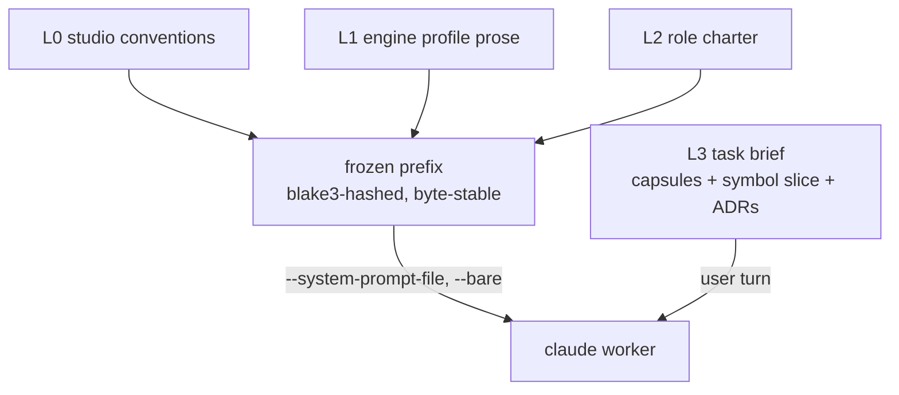

# 02: Context Engine

> **Status:** v0.1, 2026-07-20, design phase, no runtime code.
> **This document is the single source of truth for:** the layered prompt model (L0-L3), the capsule JSON schema, the three-rung summarization ladder, and the token math. [01](01-orchestrator-core.md), [03](03-state-store.md), [06](06-budget-governance.md), [07](07-engine-layer.md), and [09](09-workflows.md) reference these definitions rather than restating them.

This is the core of the token story. Everything here serves the prime directive: **feed the model minimum viable context, and never pay twice for the same tokens.**

## Layered prompt model

A worker's input is four layers. The first three are **frozen**, byte-stable, content-hashed, and delivered as one `--system-prompt-file` under `--bare`. The fourth is **volatile**, the per-task brief, delivered in the user turn.

| Layer | Contents | Volatility | Delivery |
|---|---|---|---|
| **L0** | Studio conventions: capsule protocol, output contract, escalation rules, the "minimum context" ethic | never changes | prefix, shared by all roles |
| **L1** | Engine profile prose: idioms, conventions, capability notes for the active engine ([07](07-engine-layer.md)) | changes per engine, ~3 values | prefix |
| **L2** | Role charter: the role's mandate, boundaries, tool contract ([04](04-agent-graph.md)) | changes per role, 13 values | prefix |
| **L3** | Task brief: the one task, its capsule inputs, the symbol slice, relevant ADRs | changes every invocation | user turn (not prefix) |

The frozen prefix is `L0 ++ L1 ++ L2`. Its blake3 hash is the **prefix identity** used everywhere: cache-affinity scheduling ([§cache batching](#cache-window-batching)), the `prefix_hash` on `worker_spawned`/`cache_hit` events ([05](05-event-protocol.md)), and the per-role `cache_hit_ratio` health metric ([03](03-state-store.md)).



Because the prefix bytes are identical across every same-role, same-engine worker, prompt caching (keyed on exact system-prompt bytes + model, 5-minute TTL) serves them from cache on the second and later spawns within the window. **This is the entire reason for freezing.**

## Byte-stability rules (the caching contract)

Prompt caching is a prefix match: a single byte difference anywhere in the prefix invalidates the cache from that point. The charter builder MUST guarantee byte stability:

1. **Normalize line endings** to `\n`. (`.gitattributes` sets `* text=auto`; the builder normalizes again at compose time, never trust the checkout.)
2. **No timestamps, no interpolation, no per-run identifiers** anywhere in L0-L2. The date, run id, session id, and role instance all belong in L3.
3. **Reject `{{` markers** in any prefix source file. A template marker that survives into a frozen charter means an un-substituted variable, fail the build loudly rather than ship a poisoned prefix.
4. **Deterministic ordering.** Fragment concatenation order, list order, and any serialized structure sort by a stable key. No set iteration, no map ordering.
5. **Pad past the model's minimum cacheable prefix or it silently never caches.** Minimums (confirmed this session): **Opus 4.8 = 4096 tokens, Fable 5 = 2048 tokens**. A 3k-token charter caches on the Tier-1 (Fable) seat but **silently won't** on a Tier-2/3 (Opus) role, `cache_creation` stays 0 with no error. The builder pads short Opus charters up to 4096 tokens with a stable, meaningful convention block (never whitespace filler, which invites accidental edits).

The builder emits a `prompt_frozen` event ([05](05-event-protocol.md)) with the hash, layers, and byte count every time it composes a prefix. A changed hash for an unchanged role is a bug the ledger will surface as a cratered `cache_hit_ratio`.

## Cache-window batching

Cache warmth is per-prefix and lasts 5 minutes. The scheduler exploits this with **prefix-affinity scheduling**: pending tasks that share a `prefix_hash` are dispatched in a burst so later spawns land inside the 5-minute window opened by the first. To avoid the obvious failure mode, a hot prefix starving everything else, an **anti-starvation cap** bounds how long any task waits for affinity batching (default 30s) before it dispatches regardless. Concurrency timing matters: a cache entry is readable only after the first response *begins streaming*, so the scheduler fires one worker of a new prefix, waits for its first streamed token, then releases the rest of the batch (parallel cold spawns would each pay the write premium).

## Context capsule

Capsules are the **only** inter-agent channel ([04](04-agent-graph.md)). A worker emits one via the `mcp__studio__capsule_submit` MCP tool (or the outbox fallback, [00](00-overview.md)). The daemon schema-validates it, renders it, hard-caps it, and stores it ([03](03-state-store.md)).

```jsonc
{
  "v": 1,
  "kind": "task_return" ,      // task_return | consult_answer | decision | escalation | status
  "from": "gameplay_engineer#7",
  "task": "task_01J...",       // the task this capsule answers
  "summary": "string",         // <= 512 tokens; the headline, always kept
  "outcome": "done" ,          // done | blocked | needs_verify | rejected
  "artifacts": [               // files/symbols touched, by reference not body
    {"path": "…", "symbol": "…", "change": "added|modified|removed"}
  ],
  "decisions": [               // assertions others must respect; become ADRs on kind=decision
    {"claim": "string", "rationale": "string"}
  ],
  "open_questions": ["string"],
  "do_not_revisit": ["string"], // dead ends; the daemon attaches these on re-delegation
  "handoff": "string"          // <= 1k tokens; what the next actor needs, prose
}
```

### Truncation order

A rendered capsule is hard-capped at **4k tokens**. When over budget, the daemon truncates in this fixed order (drop earliest-listed first), so the load-bearing fields survive:

1. `open_questions` (trim to 3)
2. `artifacts` (keep the 10 most-recently-touched, replace the rest with a count)
3. `handoff` (trim to 1k tokens)
4. `decisions` rationales (keep claims, trim rationales)
5. `summary` and `outcome` and `do_not_revisit` are **never** truncated, if these alone exceed 4k the submit is rejected and the worker is asked to resummarize.

### `do_not_revisit`

The field that stops loops. When a worker records a dead end ("tried the `IJobParallelFor` path, the import step can't see the generated struct"), the daemon carries it forward: any re-delegation or escalation of the same task attaches accumulated `do_not_revisit` entries to L3, so the next worker doesn't burn tokens re-deriving the same failure. Arbitration meetings ([04](04-agent-graph.md)) read it to avoid re-litigating settled dead ends.

## Three-rung summarization ladder

Context is distilled upward, cheaply, at phase boundaries. **Supersession rule: no agent ever receives the rung below the one it needs.** A sprint-level actor gets sprint rollups, never the raw task capsules; a task-level actor gets task capsules, never raw turn digests. This is what keeps L3 small as a run grows.

| Rung | What | How produced | Token cost |
|---|---|---|---|
| **Turn digest** | one-line "what this worker turn did" | **extracted by the daemon** from the capsule's `summary` + `outcome`: pure reduction over data the worker already produced | **zero model tokens** |
| **Task capsule** | the capsule above, stored | the worker's own output | (already paid) |
| **Sprint rollup** | a paragraph across a sprint's task capsules | distilled by a **cheap model** (`--model haiku`) at the phase boundary, **20s per agent spacing** to stay under rate limits | small; haiku is $1/$5 per MTok, the cheapest tier available |

The sprint-rollup distillation has a **zero-cost template fallback that always works**: if the cheap-model call is rate-limited, fails, or is over budget, the daemon emits a deterministic template rollup (counts, outcomes, decision list, open questions concatenated) with no model call. The system never blocks on summarization.

Turn digests are the reason the ladder is cheap: they are the daemon reading fields out of a capsule, not a model summarizing a transcript. Emits `summary_created` ([05](05-event-protocol.md)) at each rung with an estimated `tokens_saved`.

## Symbol index instead of inlined file bodies

L3 never inlines whole files. It carries a **symbol slice**: signatures, doc comments, and line ranges pulled from the index ([11](11-index-and-bootstrap.md)) for exactly the symbols the task names, plus a one-hop neighborhood. A worker that needs a full body calls `mcp__studio__symbol_lookup` to pull it on demand (pull, not push). This keeps the common case small and lets the rare deep-read happen without inflating every brief.

## ADR store

Decisions are durable and searchable. `kind: "decision"` capsules and arbitration outcomes ([04](04-agent-graph.md)) become ADR rows ([03](03-state-store.md)). Access is two-sided:

- **Push:** L3 automatically carries the **top 5 ADRs by FTS relevance** to the task brief, so an agent starts already aware of the decisions most likely to bind it.
- **Pull:** a worker calls `mcp__studio__decision_search` to query the store when it needs a decision the push didn't surface.

Superseding decisions link to what they replace (`decision_recorded` carries `supersedes`), so the store reads as a history, not a pile.

## Quantified savings estimate

Illustrative, using **confirmed pricing this session**: Opus 4.8 input $5.00/MTok, Fable 5 input $10.00/MTok, cache read ≈ 0.1× base, cache write ≈ 1.25× base (5-min TTL). **These are estimates. The token ledger ([03](03-state-store.md)) replaces every number here with measurement, which is the whole point of building the ledger first.**

Per Tier-2 (Opus) invocation, roughly:

| | Original crew | This design (cold, first spawn) | This design (warm, within 5-min window) |
|---|---|---|---|
| input tokens | ~40k (CLAUDE.md + hooks + ambient + role + task) | ~10k (6k frozen prefix + 4k L3) | ~10k, but 6k served from cache |
| priced as | 40k × $5.00/MTok | 6k × $6.25/MTok (write) + 4k × $5.00/MTok | 6k × $0.50/MTok (read) + 4k × $5.00/MTok |
| input cost | **≈ $0.200** | **≈ $0.058** | **≈ $0.023** |

So a warm invocation is roughly **an order of magnitude cheaper** on input, most of the saving being cache reads on the frozen prefix. The two levers are independent and multiply: `--bare` removes the ~30k of ambient/CLAUDE.md/hook tokens (the 40k→10k drop), and freezing turns the remaining prefix into cache reads (the $0.058→$0.023 drop). Output tokens are unaffected by any of this and dominate cost on generation-heavy roles. The ledger tracks input and output separately so the studio optimizes the lever that actually matters per role.

**Sanity check (verification #5):** 6000 × ($5.00 × 0.1)/1e6 = $0.003; 4000 × $5.00/1e6 = $0.020; sum $0.023. ✓ Matches the warm column.
