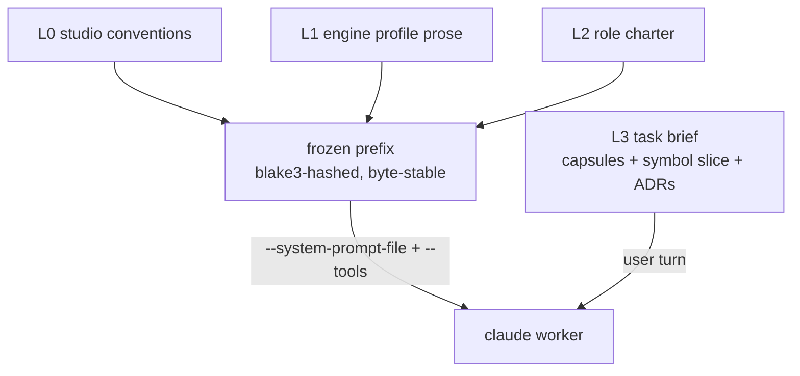

# 02: Context Engine

> **Status:** v0.2, 2026-07-21. Built in M2 and running: frozen charters, capsules, the summarization ladder and the ADR store. The symbol slice this document specifies is served by the index built in M6 ([11](11-index-and-bootstrap.md)), and its saving is now measured rather than asserted.
> **This document is the single source of truth for:** the layered prompt model (L0-L3), the capsule JSON schema, the three-rung summarization ladder, and the token math. [01](01-orchestrator-core.md), [03](03-state-store.md), [06](06-budget-governance.md), [07](07-engine-layer.md), and [09](09-workflows.md) reference these definitions rather than restating them.

This is the core of the token story. Everything here serves the prime directive: **feed the model minimum viable context, and never pay twice for the same tokens.**

## Layered prompt model

A worker's input is four layers. The first three are **frozen**, byte-stable, content-hashed, and delivered as one `--system-prompt-file` alongside `--setting-sources ""` and the role's `--tools` allowlist ([ADR 0004](adr/0004-explicit-context-control-not-bare.md)). The fourth is **volatile**, the per-task brief, delivered in the user turn.

| Layer | Contents | Volatility | Delivery |
|---|---|---|---|
| **L0** | Studio conventions: capsule protocol, output contract, escalation rules, the "minimum context" ethic | never changes | prefix, shared by all roles |
| **L1** | Engine profile prose: idioms, conventions, capability notes for the active engine ([07](07-engine-layer.md)) | changes per engine, ~3 values | prefix |
| **L2** | Role charter: the role's mandate, boundaries, tool contract ([04](04-agent-graph.md)) | changes per role, 13 values | prefix |
| **L3** | Task brief: the one task, its capsule inputs, the symbol slice, relevant ADRs | changes every invocation | user turn (not prefix) |

The frozen prefix is `L0 ++ L1 ++ L2`, **plus the role's `--tools` allowlist**, which the CLI serializes into the cached prefix as tool schemas. The blake3 hash covers charter bytes *and* the sorted allowlist, because two roles differing only in allowlist mint different cache entries and fragment the cache exactly as two different charters would ([ADR 0004](adr/0004-explicit-context-control-not-bare.md)). That hash is the **prefix identity** used everywhere: cache-affinity scheduling ([§cache batching](#cache-window-batching)), the `prefix_hash` on `worker_spawned`/`cache_hit` events ([05](05-event-protocol.md)), and the per-role `cache_hit_ratio` health metric ([03](03-state-store.md)).

**The allowlist is the dominant term.** Built-in tool schemas, not `CLAUDE.md` or ambient project context, are the bulk of a default invocation: measured, replacing the system prompt leaves ~19.5k input tokens and emptying the tool list drops the same call to **184**. A role's allowlist therefore sets its per-spawn token floor before a single charter byte is counted, which makes [04](04-agent-graph.md)'s allowlist table a cost surface and not merely a permissions surface.



Because the prefix bytes are identical across every same-role, same-engine worker, prompt caching (keyed on exact system-prompt bytes + tool set + model, **1-hour TTL**) serves them from cache on the second and later spawns within the window. **This is the entire reason for freezing.** Measured across separate subprocesses: 8867 tokens written cold at $0.0888, the same 8867 read warm at $0.0051, a **17.4×** reduction.

## Byte-stability rules (the caching contract)

Prompt caching is a prefix match: a single byte difference anywhere in the prefix invalidates the cache from that point. The charter builder MUST guarantee byte stability:

1. **Normalize line endings** to `\n`. (`.gitattributes` sets `* text=auto`; the builder normalizes again at compose time, never trust the checkout.)
2. **No timestamps, no interpolation, no per-run identifiers** anywhere in L0-L2. The date, run id, session id, and role instance all belong in L3.
3. **Reject `{{` markers** in any prefix source file. A template marker that survives into a frozen charter means an un-substituted variable, fail the build loudly rather than ship a poisoned prefix.
4. **Deterministic ordering.** Fragment concatenation order, list order, and any serialized structure sort by a stable key. No set iteration, no map ordering.
5. **Pad past the model's minimum cacheable prefix or it silently never caches.** Minimums (documented, **not** probed): **Opus 4.8 = 4096 tokens, Fable 5 = 2048 tokens**. A 3k-token charter caches on the Tier-1 (Fable) seat but **silently won't** on a Tier-2/3 (Opus) role, `cache_creation` stays 0 with no error. The builder pads short Opus charters up to 4096 tokens with a stable, meaningful convention block (never whitespace filler, which invites accidental edits). M1 measurements are consistent with this (a 184-token prefix produced `cache_creation: 0`; an 8867-token prefix cached), but the exact thresholds were never isolated, so treat them as the untested part of this rule.

The builder emits a `prompt_frozen` event ([05](05-event-protocol.md)) with the hash, layers, and byte count every time it composes a prefix. A changed hash for an unchanged role is a bug the ledger will surface as a cratered `cache_hit_ratio`.

## Cache-window batching

Cache warmth is per-prefix and lasts **1 hour** (measured: `cache_creation.ephemeral_1h`, with `ephemeral_5m` at zero). This is 12× the 5-minute window the design originally assumed, and it **substantially de-risks the whole scheduling story**: with 13 roles and an hour of warmth, a busy sprint keeps essentially every prefix hot without the scheduler doing anything clever.

Prefix-affinity scheduling therefore drops from a load-bearing mechanism to an optimization: pending tasks sharing a `prefix_hash` are still dispatched together where it is free to do so, but the **anti-starvation cap is no longer a tension worth tuning**, because no task needs to wait for a batch to catch a window that will still be open an hour later. The one timing rule that survives is a cold-start rule, not a window rule: a cache entry is readable only after the first response *begins streaming*, so the scheduler fires one worker of a **new** prefix, waits for its first streamed token, then releases the rest (parallel cold spawns would each pay the write premium).

The write premium is **2.0× base**, measured exactly (8867 tokens billed $0.0888 against a $0.0443 uncached baseline), not the 1.25× that a 5-minute TTL would cost. So a cold spawn is dearer than the design assumed and a warm one lasts far longer: both changes push the same direction, toward fewer distinct prefixes, which is the argument in [ADR 0002](adr/0002-thirteen-roles.md).

## Context capsule

Capsules are the **only** inter-agent channel ([04](04-agent-graph.md)). A worker emits one via the `mcp__studio__capsule_submit` MCP tool, which M1 confirmed attaches ([ADR 0004](adr/0004-explicit-context-control-not-bare.md)); the watched-outbox fallback ([13](13-risks.md) R1) stays documented but is not built. The daemon schema-validates it, renders it, hard-caps it, and stores it ([03](03-state-store.md)).

```jsonc
{
  "v": 1,
  "kind": "task_return" ,      // task_return | consult_answer | decision | escalation | status
  "from": "gameplay_engineer#7",
  "task": "task_01J...",       // the task this capsule answers
  "summary": "string",         // <= 512 tokens; the headline, always kept
  "outcome": "done" ,          // done | blocked | needs_verify | rejected
  "artifacts": [               // files/symbols touched, by reference not body
    {"path": "…", "symbol": "…", "change": "added|modified|removed"}
  ],
  "decisions": [               // assertions others must respect; become ADRs on kind=decision
    {"claim": "string", "rationale": "string"}
  ],
  "open_questions": ["string"],
  "do_not_revisit": ["string"], // dead ends; the daemon attaches these on re-delegation
  "handoff": "string"          // <= 1k tokens; what the next actor needs, prose
}
```

### Truncation order

A rendered capsule is hard-capped at **4k tokens**. When over budget, the daemon truncates in this fixed order (drop earliest-listed first), so the load-bearing fields survive:

1. `open_questions` (trim to 3)
2. `artifacts` (keep the 10 most-recently-touched, replace the rest with a count)
3. `handoff` (trim to 1k tokens)
4. `decisions` rationales (keep claims, trim rationales)
5. `summary` and `outcome` and `do_not_revisit` are **never** truncated, if these alone exceed 4k the submit is rejected and the worker is asked to resummarize.

### `do_not_revisit`

The field that stops loops. When a worker records a dead end ("tried the `IJobParallelFor` path, the import step can't see the generated struct"), the daemon carries it forward: any re-delegation or escalation of the same task attaches accumulated `do_not_revisit` entries to L3, so the next worker doesn't burn tokens re-deriving the same failure. Arbitration meetings ([04](04-agent-graph.md)) read it to avoid re-litigating settled dead ends.

## Three-rung summarization ladder

Context is distilled upward, cheaply, at phase boundaries. **Supersession rule: no agent ever receives the rung below the one it needs.** A sprint-level actor gets sprint rollups, never the raw task capsules; a task-level actor gets task capsules, never raw turn digests. This is what keeps L3 small as a run grows.

| Rung | What | How produced | Token cost |
|---|---|---|---|
| **Turn digest** | one-line "what this worker turn did" | **extracted by the daemon** from the capsule's `summary` + `outcome`: pure reduction over data the worker already produced | **zero model tokens** |
| **Task capsule** | the capsule above, stored | the worker's own output | (already paid) |
| **Sprint rollup** | a paragraph across a sprint's task capsules | distilled by a **cheap model** (`--model haiku`) at the phase boundary, **20s per agent spacing** to stay under rate limits | small; haiku is $1/$5 per MTok, the cheapest tier available |

The sprint-rollup distillation has a **zero-cost template fallback that always works**: if the cheap-model call is rate-limited, fails, or is over budget, the daemon emits a deterministic template rollup (counts, outcomes, decision list, open questions concatenated) with no model call. The system never blocks on summarization.

Turn digests are the reason the ladder is cheap: they are the daemon reading fields out of a capsule, not a model summarizing a transcript. Emits `summary_created` ([05](05-event-protocol.md)) at each rung with an estimated `tokens_saved`.

## Symbol index instead of inlined file bodies

L3 never inlines whole files. It carries a **symbol slice**: signatures, doc comments, and line ranges pulled from the index ([11](11-index-and-bootstrap.md)) for exactly the symbols the task names, plus a one-hop neighborhood. A worker that needs a full body calls `mcp__studio__symbol_lookup` to pull it on demand (pull, not push). This keeps the common case small and lets the rare deep-read happen without inflating every brief.

**Measured, not assumed** (`probes/index-tokens.sh`). Two workers, same 63-file Godot project, same question requiring three facts that span two scripts and a scene file. One arm gets `symbol_lookup` and no file access; the other gets `Read,Grep,Glob` and no index. Both answered correctly every run.

| run | index route | file route | token ratio | cost ratio |
|---|---|---|---|---|
| 1 | 5299 | 12360 | 2.33× | 4.64× |
| 2 | 3608 | 12360 | 3.43× | 1.58× |
| 3 | 5299 | 12360 | 2.33× | 2.21× |

Billed input tokens. **The index route costs roughly 2.3–3.4× fewer**, and settles the question in **2 tool calls against 4**. The file route was strikingly reproducible at 12360 every run: `Grep`, `Grep`, `Glob`, then one `Read` whose body dominates the total.

Two honest caveats. **The cost ratio is not the token ratio and is nowhere near as stable** — 4.64×, 1.58×, 2.21× across those same three runs, because it depends entirely on how much of each arm's input arrives as a 0.1× cache read rather than a 2.0× cache write. Quote the token figure; a single dollar figure here says more about cache state than about the index. And this is a *retrieval* task, the index's best case; a task that genuinely needs a whole file body will read one either way.

## ADR store

Decisions are durable and searchable. `kind: "decision"` capsules and arbitration outcomes ([04](04-agent-graph.md)) become ADR rows ([03](03-state-store.md)). Access is two-sided:

- **Push:** L3 automatically carries the **top 5 ADRs by FTS relevance** to the task brief, so an agent starts already aware of the decisions most likely to bind it.
- **Pull:** a worker calls `mcp__studio__decision_search` to query the store when it needs a decision the push didn't surface.

Superseding decisions link to what they replace (`decision_recorded` carries `supersedes`), so the store reads as a history, not a pile.

## Quantified savings, measured

**No longer an estimate.** The prefix figures below are M1 probe measurements on Opus 4.8 (input $5.00/MTok, cache read 0.1× base, cache write 2.0× base at the 1-hour TTL). The L3 column is still projected, because a representative task brief does not exist until real workflows run; the ledger ([03](03-state-store.md)) settles it.

Per Tier-2 (Opus) invocation, `--tools "Read,Grep,Glob"`:

| | Default invocation (nothing stripped) | This design (cold, first spawn) | This design (warm, within the hour) |
|---|---|---|---|
| prefix tokens | 22572 **(measured)** | 8867 **(measured)** | 8867, served from cache **(measured)** |
| prefix cost | **$0.2258 (measured)** | **$0.0888 (measured)** | **$0.0051 (measured)** |
| + L3 brief (~4k, projected) | — | ≈ $0.020 | ≈ $0.020 |
| input cost per invocation | ≈ $0.226 | ≈ $0.109 | ≈ **$0.025** |

The **prefix** is where the whole story lives: 17.4× between cold and warm, measured directly, process to process. Against a default invocation a warm spawn is **44× cheaper on the prefix** and roughly 9× cheaper once a projected brief is added.

The two levers are independent and multiply, but **not the two levers this document originally named**. It is the **tool allowlist** that removes the bulk (22572 → 8867 here, and to 184 with an empty allowlist), not the stripping of `CLAUDE.md` and ambient context, which turned out to be a minor term. Freezing then turns what remains into cache reads ($0.0888 → $0.0051). Output tokens are unaffected by any of this and dominate cost on generation-heavy roles; the ledger tracks input and output separately so the studio optimizes the lever that actually matters per role.

**Sanity check:** 8867 × ($5.00 × 0.1)/1e6 = $0.0044, against $0.0051 measured with 4 output tokens included. ✓ Cold: 8867 × ($5.00 × 2.0)/1e6 = $0.0887 against $0.0888 measured. ✓ The 2.0× write premium is exact.
