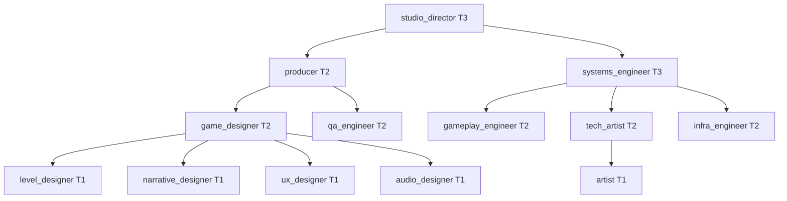

# 04: Agent Graph

> **Status:** v0.1, 2026-07-20, design phase, no runtime code.
> **This document is the single source of truth for the role registry.** No other document enumerates roles or assigns them a model, tier, department, or tool allowlist. Other docs reference roles by `id` only. No engine name appears anywhere in this document. Engine specialization is a prompt layer applied at charter-composition time ([07](07-engine-layer.md)), never a role.

## Why 13

The original crew had **49** agents. The dominant cause was **triplication**: a "gameplay engineer" existed once per engine, a "tech artist" once per engine, and so on. Engine is not an axis of *role*; it is an axis of *tooling and idiom*. Collapsing it removes the triplication and lands at **13**.

Two forces set the number:

1. **Distinctness.** A role earns its place only if its charter, tool allowlist, or escalation position differs materially from every other role. Roles that differed only by engine were merged.
2. **Cache economics.** Each role is a distinct frozen system-prompt prefix. Prompt caching is keyed on exact prefix bytes with a 5-minute TTL. Every extra role fragments the cache window, more distinct prefixes, fewer same-prefix spawns inside any 5-minute span, colder caches, more `cache_creation` billing. Fewer roles means hotter caches. This is quantified in [ADR 0002](adr/0002-thirteen-roles.md).

Rare specialisms (e.g. shader optimization, netcode, localization) are **not** standing roles. They are **overlay fragments** appended to a base role's volatile suffix when a task needs them. See [02 §append overlays](02-context-engine.md). An overlay never changes the frozen prefix, so it never fragments the cache.

## Tiers and models

| Tier | Model | Effort band | Used for |
|---|---|---|---|
| 1 | **Fable 5** | `low`-`medium` | high-volume content and mechanical production work |
| 2 | **Opus 4.8** | `medium`-`high` | most engineering and design judgment |
| 3 | **Opus 4.8** | `high`-`xhigh` | hardest systems work and studio-level arbitration |

Model per invocation is derived from the role's tier; it is not stored per-task. The daemon passes `--model` and `--effort` from the row below (effort may be raised one band by a workflow node, never lowered below the role floor).

## The registry

`id` is stable and machine-facing. `escalates_to` names the role a blocked or out-of-scope task is handed up to; the chain terminates at `studio_director`, which escalates to the human.

| id | Title | Tier | Dept | Model | Effort | escalates_to |
|---|---|---|---|---|---|---|
| `studio_director` | Studio Director | 3 | leadership | opus | xhigh | *(human)* |
| `producer` | Producer | 2 | production | opus | high | `studio_director` |
| `game_designer` | Game Designer | 2 | design | opus | high | `producer` |
| `level_designer` | Level Designer | 1 | design | fable | medium | `game_designer` |
| `narrative_designer` | Narrative Designer | 1 | design | fable | medium | `game_designer` |
| `ux_designer` | UX/UI Designer | 1 | design | fable | medium | `game_designer` |
| `systems_engineer` | Systems & Tools Engineer | 3 | engineering | opus | xhigh | `studio_director` |
| `gameplay_engineer` | Gameplay Engineer | 2 | engineering | opus | high | `systems_engineer` |
| `tech_artist` | Technical Artist | 2 | art | opus | medium | `systems_engineer` |
| `artist` | Artist | 1 | art | fable | low | `tech_artist` |
| `audio_designer` | Audio Designer | 1 | audio | fable | low | `game_designer` |
| `qa_engineer` | QA Engineer | 2 | qa | opus | medium | `producer` |
| `infra_engineer` | Build & Infra Engineer | 2 | infra | opus | high | `systems_engineer` |

Six departments, `leadership`, `production`, `design`, `engineering`, `art`, `audio`, `qa`, `infra`, drive avatar fill color in [12](12-visual-workspace.md). (Eight labels; `leadership` and `production` share a visual family, as do `qa` and `infra`, so the floor renders six fills. The registry keeps them distinct because escalation differs.)

## Tool allowlists

Workers run `--bare --permission-mode dontAsk --allowedTools <list>`. Under `--bare` there is no ambient MCP; the orchestrator's stdio MCP tools (prefixed `mcp__studio__`) are attached explicitly (or delivered via the outbox fallback, [00 §unverified](00-overview.md#two-unverified-behaviors-m1-settles-these-first)). Every role gets the **orchestrator tools**; filesystem and shell access is scoped by tier and department.

Orchestrator MCP tools (all roles): `mcp__studio__capsule_submit`, `mcp__studio__decision_search`, `mcp__studio__symbol_lookup`, `mcp__studio__escalate`, `mcp__studio__request_meeting`.

| Role class | Read/Grep/Glob | Edit/Write | Bash | Notes |
|---|---|---|---|---|
| designers (`level_`, `narrative_`, `ux_`, `game_designer`) | ✔ | design docs & data files only | n/a | no build commands; produce briefs and data, not code |
| engineers (`gameplay_`, `systems_`, `infra_engineer`) | ✔ | source + config | build/test via engine driver only | never run raw engine CLIs directly; go through `verify()` ([08](08-verification.md)) |
| art/audio (`artist`, `tech_artist`, `audio_designer`) | ✔ | asset source + import config | import command via driver only | binary assets tracked by index ([11](11-index-and-bootstrap.md)) |
| `qa_engineer` | ✔ | test files only | test command via driver only | authors tests; the daemon runs them |
| `producer`, `studio_director` | ✔ | none (coordination only) | none | operate through capsules, meetings, and workflow control |

The daemon, not the worker, invokes engine command lines. A worker asking to "run the build" emits a capsule requesting verification; the daemon runs [`EngineDriver::verify()`](08-verification.md) and returns structured failures. Agents never read raw engine logs.

## Interaction primitives

All four are **first-class meetings** in the event protocol ([05](05-event-protocol.md)) and render as choreography on the floor ([12](12-visual-workspace.md)). All inter-agent payloads are **capsules** ([02](02-context-engine.md)). There is no other channel.

### Delegation (vertical, down)
A role hands a scoped subtask to a role below it. The parent writes a task brief (L3 volatile layer), the daemon spawns the child worker, the child returns a capsule. The parent never sees the child's raw transcript, only its capsule. Emits `task_delegated` → `task_returned`.

### Horizontal consultation (sideways, via forked session)
When a role needs another role's judgment without handing off ownership, the daemon **forks** the consulting session (`--fork-session`) so the consultant starts from shared context without polluting the originator's session. The consultant returns a capsule; the fork is discarded. Emits `consult_requested` → `consult_answered`. Forking (vs. a fresh spawn) is chosen only when the shared prefix is already cache-warm and the consult genuinely needs the originator's task context; otherwise a plain spawn is cheaper.

### Escalation (vertical, up)
A worker that is blocked, out of scope, or over a trust threshold ([10](10-standards-and-trust.md)) calls `mcp__studio__escalate`. The daemon routes to `escalates_to`, attaching the escalating capsule and a `do_not_revisit` marker so the parent doesn't re-delegate the same dead end. Emits `escalated`.

### Conflict arbitration (meeting)
When two capsules assert incompatible decisions (detected at capsule-submit time against the decision store, [03](03-state-store.md)), the daemon convenes an **arbitration meeting**: it spawns the nearest common ancestor in the escalation tree with both capsules as input. The ancestor emits a decision capsule that becomes an ADR ([02 §ADR store](02-context-engine.md)). Emits `meeting_started` (kind `arbitration`) → `decision_recorded` → `meeting_ended`.

## What a role is, precisely

A role is a **row above plus a frozen L2 charter** ([02](02-context-engine.md)). The row picks the model, effort, tools, and escalation edge; the charter is the prose. Nothing else distinguishes roles. Adding a role means adding one row and one charter file and regenerating the floor map ([12](12-visual-workspace.md) generates deterministically from this registry, so no hand-drawing is needed). Removing a role means deleting both. Because the floor and the workflows ([09](09-workflows.md)) bind to `id`, this table is the only place the set of roles is defined.
