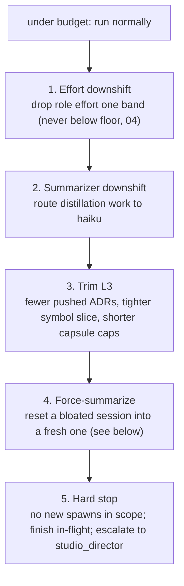

# 06: Budget Governance

> **Status:** v0.1, 2026-07-20, design phase, no runtime code.
> **Owns:** the budget model and the five-step degradation ladder. Reads the `token_ledger` and `budgets` tables ([03](03-state-store.md)); uses the layered-prompt and force-summarize mechanics from [02](02-context-engine.md); consumed by the supervisor's pre-spawn gate ([01](01-orchestrator-core.md)).

## Budgets are in tokens, with a USD mirror

The unit of account is **tokens**, because tokens are what the ledger measures exactly and what the subscription meters. USD is a **mirror**: derived from tokens via the model's per-MTok price ([02](02-context-engine.md) pricing, Fable 5 $10/$50, Opus 4.8 $5/$25, cache read 0.1×, **cache write 2.0×** at the measured 1-hour TTL) for display and reporting only. Enforcement always compares tokens to token limits; the USD number never gates anything, because prices can move and cache accounting makes per-request USD lumpy.

The 2.0× write premium (measured, [02](02-context-engine.md)) is double what this document originally assumed, which makes a **cold spawn** the expensive event to avoid. The 1-hour TTL makes that easy: warmth outlasts any realistic sprint gap, so the ladder below rarely needs to fire on prefix costs at all.

Two scopes, both in the `budgets` table ([03](03-state-store.md)):

- **Task budget**: a ceiling for one task and its repair rounds/consults. Sized from the role's tier and the workflow node.
- **Sprint budget**: a ceiling for a whole run/sprint across all its tasks. The task budgets roll up into it.

`spent_tokens` is maintained from the realtime-spend query ([03](03-state-store.md)): final ledger rows are authoritative, in-flight workers contribute their latest interim estimate.

## Enforcement at three points

| Point | Check | On breach |
|---|---|---|
| **Pre-spawn** | Would this worker's *projected* input (frozen prefix size + L3 size, both known before spawn) plus a per-role output reserve fit under both the task and sprint remaining? | Refuse or degrade before paying anything ([01](01-orchestrator-core.md) consults this gate) |
| **In-flight** | Interim `token_usage` estimates (or EMA fallback, see below) crossing a soft threshold | Emit `budget_warning`; arm the degradation ladder |
| **Capsule time** | On `capsule_submit`, the now-known task spend against the task budget | Apply the next ladder step for the next task in scope |

### In-flight enforcement reads real numbers

M1 settled this: **streamed events do carry `usage`** ([00](00-overview.md)). `stream_event`/`message_start` arrives with a full block (`input_tokens`, `cache_creation_input_tokens`, `cache_read_input_tokens`, `output_tokens`), and four pre-`result` events carried usage in a short probe turn. Input-side numbers are therefore **exact from the first streamed event**, before any output is generated, which is precisely what the pre-spawn projection wanted to confirm.

In-flight enforcement reads those deltas directly. The **EMA fallback is not built**; it stays described in [13](13-risks.md) as the contingency if the stream shape regresses. The settling rule is unchanged and still matters: the terminal `result` writes the authoritative `estimate=0` ledger row and supersedes every interim row, so an in-flight number is at worst slightly stale, never a wrong charge.

## The five-step degradation ladder

Applied in order as a scope approaches its limit. Each step is cheaper than the one before it and emits `degradation_applied` ([05](05-event-protocol.md)) with the step number. The ladder is per-scope; a sprint nearing its cap degrades every task under it.

1. **Effort downshift**: lower `--effort` one band, respecting the role floor ([04](04-agent-graph.md)). Cheapest lever, smallest quality cost.
2. **Summarizer downshift**: route the summarization ladder's distillation work to `--model haiku` ($1/$5 per MTok). Note the direction: **there is no step that routes work to Fable.** Fable is 2x Opus ($10/$50 against $5/$25), so moving work onto it raises spend. The only model move that saves money is downward to haiku, and only the summarizer is eligible, because it does bounded extraction rather than judgment. Tier 1 stays on Fable regardless of budget state; if the director's spend is the problem, the answer is fewer director invocations, not a cheaper director.
3. **Trim L3**: the context engine tightens the volatile layer: fewer pushed ADRs (top-3 not top-5), a narrower symbol slice, lower capsule render caps. The frozen prefix is untouched, so cache warmth is preserved even while degrading.

   **Not a ladder step: trimming the `--tools` allowlist.** It is the largest single input lever available ([02](02-context-engine.md): 22572 tokens against 184), and it is deliberately excluded from the ladder. Dropping a tool changes the frozen prefix, which mints a new `prefix_hash`, cold-starts the cache, and costs a 2.0× write premium immediately, to save on spawns that may never happen. Degrading by allowlist would spend money to save money. Allowlists are set per role class at design time ([04](04-agent-graph.md)) and are not a runtime dial.
4. **Force-summarize**: **the emphasized lever.** A long-lived session accumulates a bloated JSONL history; every `--resume` re-processes it. Force-summarize distills the session's state into a single task capsule ([02](02-context-engine.md)) and **starts a fresh session** seeded with that capsule as L3, discarding the heavy history. This collapses a session whose per-turn input has crept up back down to a clean frozen-prefix-plus-small-L3 shape, often reclaiming more budget than steps 1-3 combined, because it attacks input-token bloat at its root.
5. **Hard stop**: no new workers spawn in the scope; in-flight workers finish; the daemon escalates to `studio_director` ([04](04-agent-graph.md)) with a spend report. `budget_exhausted` fires. Nothing is silently dropped. The human sees the stop.

## Why force-summarize matters most

The other steps trade quality for tokens at the margin. Force-summarize is different: it targets the compounding cost of long sessions. Under `--resume`, a session that has run 40 turns pays to re-read all 40 turns of history on turn 41. The frozen-prefix design keeps the *prefix* cheap, but the *message history* still grows. Resetting a bloated session into a fresh one seeded with a summary is the only ladder step that reduces the structural, per-turn input cost rather than shaving a one-time slice, which is why it sits just below hard stop and is preferred over stopping whenever the work can continue.
