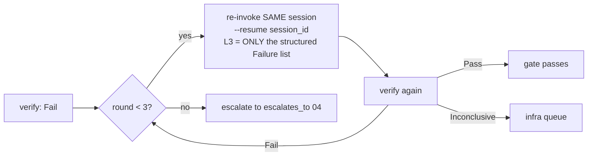

# 08: Verification

> **Status:** v0.1, 2026-07-20, design phase, no runtime code.
> **Owns:** the `EngineDriver::verify()` contract and the per-engine report parsers. Consumes the engine profiles ([07](07-engine-layer.md)) and is consumed by the workflow gates ([09](09-workflows.md)). Every report format named in [07](07-engine-layer.md) has a parser here (verification #4).

## Principle

**Agents never read raw engine logs.** Verification is the daemon's job: it runs the profile command, parses the machine-readable report into a uniform structured result, and hands agents only a structured failure list. This keeps a 40k-line UE cook log out of a worker's context and keeps failures comparable across three very different engines.

## The uniform contract

```rust
/// Implemented per engine; the daemon owns the impls, workers never call them.
trait EngineDriver {
    fn verify(&self, scope: VerifyScope, project: &ProjectPaths) -> VerifyResult;
}

enum VerifyScope {
    Compile,     // profile [commands].compile
    TestFast,    // [commands].test_fast
    TestFull,    // [commands].test_full
    Import,      // [commands].import
    Export,      // [commands].export
}

struct VerifyResult {
    verdict: Verdict,
    failures: Vec<Failure>,       // empty on Pass
    scope: VerifyScope,
    engine: String,
    duration_ms: u64,
    raw_report_path: String,      // for humans/debugging; never sent to a worker
}

enum Verdict { Pass, Fail, Inconclusive }

struct Failure {
    id: String,                   // stable within a report, for dedup across repair rounds
    kind: FailureKind,            // Compile | Test | Import | Export | Timeout | Crash
    symbol: Option<String>,       // resolved against the index (11) when the report gives a location
    file: Option<String>,
    line: Option<u32>,
    message: String,              // one line, engine-normalized
    detail: Option<String>,       // a few lines max; NOT the raw log
}
```

`verify()` emits `verify_started` then `verify_result` ([05](05-event-protocol.md)); the `failures` on the wire are digests, not full `Failure` structs.

## `Inconclusive` is first-class

A run that neither passed nor produced a real failure. A licensing timeout, an editor-lock contention abort, an OOM, a missing GPU for a play-mode test, a crash before any test ran, is **`Inconclusive`, not `Fail`**. This is the single most important verdict in the design. `Fail` routes to agents to fix; `Inconclusive` routes to an **infra queue** (`inconclusive_flagged` event → `infra_engineer`, [04](04-agent-graph.md)). **Agents never try to fix phantom failures**, because phantom failures never reach them. Determining `Inconclusive` is a per-driver responsibility: exit codes that indicate infrastructure (not test) failure, report files that are absent or empty when the command "succeeded," known-flaky signatures in the log scan.

## Per-engine parsers

Each maps a profile report format ([07](07-engine-layer.md)) into `Vec<Failure>`:

| Format ([07](07-engine-layer.md)) | Parser | Produces |
|---|---|---|
| `nunit3` (Unity test_fast/test_full) | **NUnit3 XML parser**: walks `<test-case result="Failed">`, reads `<failure><message>`/`<stack-trace>`, maps the fixture+method to a symbol via the index | `FailureKind::Test` with `symbol`, `message`, trimmed `detail` |
| `ue_automation_json` (UE5 test_fast/test_full) | **UE automation JSON parser, defensively coded**: the report schema drifts across 5.x ([13](13-risks.md)); the parser reads the fields it knows, tolerates missing/renamed keys, and on a shape it can't parse returns **`Inconclusive`** rather than guessing a pass | `FailureKind::Test`; falls back to `Inconclusive` on schema drift |
| `junit` (Godot GUT test_fast/test_full) | **GUT JUnit XML parser**: standard JUnit `<testsuite>/<testcase><failure>`; maps to the `.gd` script + method | `FailureKind::Test` with `file`, `line`, `message` |
| `unity_buildreport` (Unity export) | **Unity BuildReport JSON parser**: reads build steps and errors | `FailureKind::Export` |
| exit-code + log scan (all `compile`/`import`, UE5 export, Godot export) | **structured log scanner**: per-engine regex ruleset over the command's log, keyed to error signatures; exit code sets the floor verdict | `FailureKind::Compile`/`Import`/`Export`, or `Inconclusive` on an infra signature |

The log scanner is the fallback path for any command that produces no structured report; its per-engine rulesets are versioned alongside the profile.

## The repair loop belongs to the daemon

When `verify()` returns `Fail`, the daemon runs a bounded repair loop, **the agent does not orchestrate it**:



- The daemon **re-invokes the same CLI session** (`--resume`, [00](00-overview.md)) so the worker keeps its context, and injects **only the structured `Failure` list** as the new L3. Not the raw log, not the whole report.
- **Max 3 rounds**, each emitting `repair_round` ([05](05-event-protocol.md)). After the third failed round, the daemon **escalates** to the role's `escalates_to` ([04](04-agent-graph.md)) with the failure history and accumulated `do_not_revisit` ([02](02-context-engine.md)) attached.
- An `Inconclusive` at any round exits the loop to the infra queue immediately. It does not consume a repair round, because there is nothing for the agent to repair.

This is what makes verification cheap in tokens: a worker sees a short, normalized failure list up to three times, never the engine's raw output, and never an infrastructure failure dressed up as a bug.
